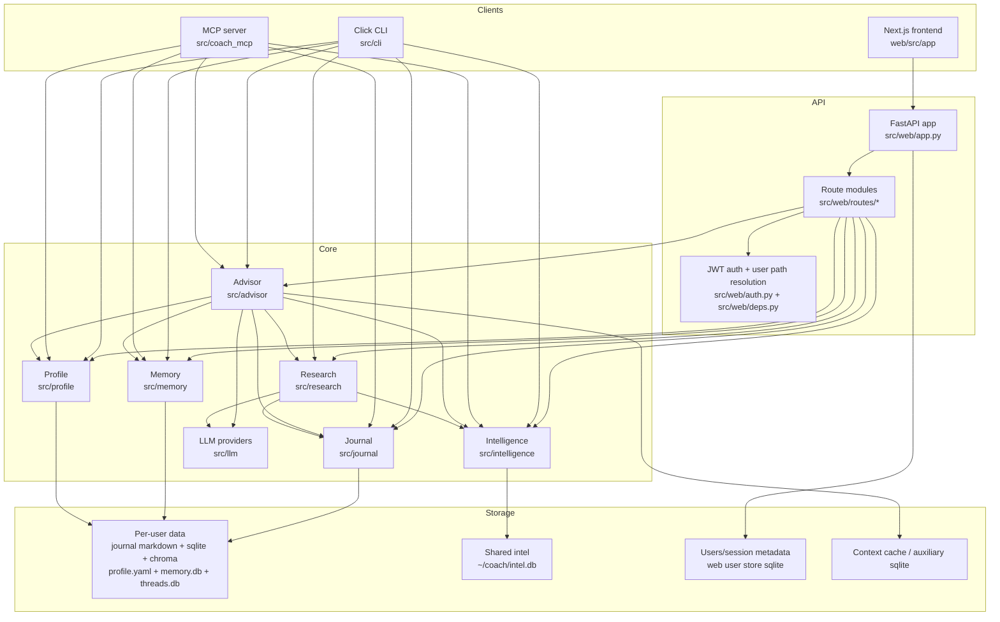
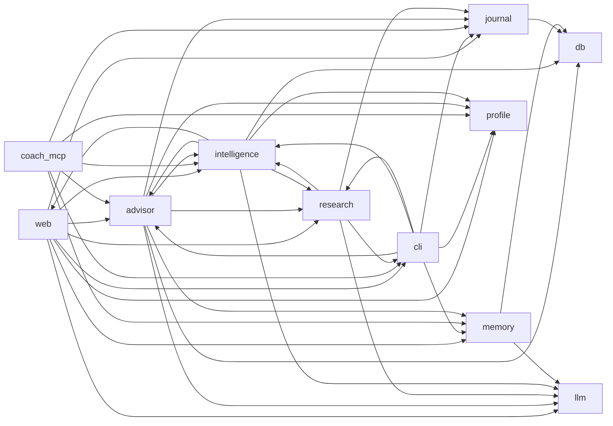

# Architecture

## Overview

StewardMe is a multi-surface AI assistant with three Python entrypoints and one separate web frontend:

- `coach` CLI for local workflows and operations
- FastAPI backend for authenticated multi-user web access
- MCP server for tool-based access from external agent clients
- Next.js frontend in `web/` for the browser UI

All four surfaces converge on the same domain modules in `src/`: `advisor`, `intelligence`, `journal`, `memory`, `profile`, `research`, and `llm`. Persistence is intentionally split between per-user stores (`~/coach/users/{user_id}/...`) and a shared world-intel store (`~/coach/intel.db`).

---

## Architecture Diagram

---

## Module Responsibilities

| Module | Primary responsibility | Key entry files | Main dependencies |
|---|---|---|---|
| `web` | Multi-user API layer, auth, route wiring, request-scoped path resolution, web-specific persistence | `src/web/app.py`, `src/web/routes/*`, `src/web/deps.py` | `advisor`, `journal`, `intelligence`, `research`, `memory`, `profile`, `llm`, `cli` config |
| `advisor` | Main orchestration layer for ask/brief/recommendation flows, RAG assembly, prompts, scoring, action briefs, agentic behaviors | `src/advisor/engine.py`, `src/advisor/rag.py`, `src/advisor/recommendations.py` | `llm`, `journal`, `intelligence`, `profile`, `memory`, `research` |
| `intelligence` | External world-intel ingestion, dedup, storage, scheduling, source adapters, trending radar, watchlists | `src/intelligence/scraper.py`, `src/intelligence/scheduler.py`, `src/intelligence/sources/*` | `db`, `research`, `llm`, some `cli`/`web` integration helpers |
| `research` | Topic selection, web search, synthesis, dossier generation, long-form research workflows | `src/research/agent.py`, `src/research/web_search.py`, `src/research/synthesis.py` | `llm`, `intelligence`, `journal`, `cli` config |
| `journal` | Personal journaling storage, embeddings sync, semantic search, FTS, trends, threads, export | `src/journal/storage.py`, `src/journal/search.py`, `src/journal/thread_store.py` | `db` |
| `memory` | Fact extraction, conflict resolution, persistent user memory, retrieval for advisor | `src/memory/store.py`, `src/memory/pipeline.py`, `src/memory/extractor.py` | `db`, `llm` |
| `profile` | Structured user profile model, onboarding/interview flow, profile persistence and summaries | `src/profile/storage.py`, `src/profile/interview.py` | mostly self-contained |
| `llm` | Provider abstraction and adapters for Claude, OpenAI, Gemini | `src/llm/factory.py`, `src/llm/base.py`, `src/llm/providers/*` | provider SDKs |
| `cli` | Local operator surface, config loading, logging, command registration, daemon/admin flows | `src/cli/main.py`, `src/cli/commands/*`, `src/cli/config.py` | almost every domain module |
| `coach_mcp` | MCP tool server exposing journal/intel/advisor/profile actions to external agent clients | `src/coach_mcp/server.py`, `src/coach_mcp/tools/*` | `advisor`, `journal`, `intelligence`, `memory`, `profile`, `cli` bootstrap |
| `web/` frontend | Browser UI, authentication, dashboard pages, API client, session handling | `web/src/app/*`, `web/src/lib/api.ts`, `web/src/lib/auth.ts` | FastAPI backend + NextAuth |
| `db.py` and shared utilities | Shared SQLite connection policy and low-level helpers | `src/db.py`, `src/chroma_utils.py`, `src/shared_types.py`, `src/observability.py` | foundational |

---

## Dependency Graph

### Logical package graph

### Observed dependency shape

- `journal`, `memory`, and `profile` are the cleanest domain modules.
- `advisor` is the system hub; nearly every surface or workflow eventually flows through it.
- `web` and `cli` are not thin shells yet; both import deeply into domain modules.
- `intelligence`, `research`, `advisor`, `web`, and `cli` form the densest dependency cluster.

### Notable package-level cycles

- `advisor` ? `intelligence`
- `advisor` ? `web`
- `cli` ? `research`
- `cli` ? `intelligence`
- `intelligence` ? `web`

These cycles do not prevent the app from working, but they increase the risk of import-order surprises, harder test setup, and blurred ownership boundaries.

---

## Potential Weak Points

### 1. Dense cross-package coupling around orchestration

The repository has a strong center of gravity around `advisor`, `web`, `intelligence`, `research`, and `cli`. That makes feature delivery fast, but it also means changes in one orchestration path can ripple across multiple surfaces.

**Risk:** harder refactors, more mocking in tests, and higher chance of accidental regressions.

### 2. Composition roots still own operational behavior

`src/web/app.py`, `src/cli/main.py`, and `src/coach_mcp/server.py` are more than thin entrypoints: they also own config wiring, startup side effects, and module composition.

**Risk:** startup failures are harder to isolate and operational concerns leak into application structure.

### 3. Persistence model is powerful but fragmented

The system uses markdown files, multiple SQLite databases, Chroma embeddings, per-user directories, and a shared intel DB.

**Risk:** migrations, backup/restore, and cross-store consistency are easy to get wrong. Bugs often appear as path-resolution or “wrong store” issues rather than obvious logic failures.

### 4. Shared-vs-user-scoped storage is a recurring correctness boundary

The architecture intentionally mixes global intel with per-user journal/profile/memory data.

**Risk:** web routes and helper functions must choose the correct store every time. Any accidental use of shared storage for personal data becomes a multi-user isolation bug.

### 5. Surface duplication can drift over time

CLI commands, web routes, and MCP tools expose overlapping capabilities, but they are implemented in different wrappers.

**Risk:** validation, serialization, and error handling can diverge between surfaces even when the underlying business logic is the same.

### 6. Optional-provider and external-source fanout increases failure modes

The app supports multiple LLM providers and many intel sources with different schemas, reliability profiles, and rate limits.

**Risk:** behavior is robust overall, but edge cases cluster around retries, partial failures, throttling, and normalization of heterogeneous upstream data.

### 7. Some technical debt remains in entrypoint ergonomics

A representative example is `src/cli/main.py` mutating `sys.path` for imports.

**Risk:** packaging/runtime assumptions are less explicit than they should be, and import behavior can differ between environments.

---

## Phased Refactor Plan

### Phase 1 - Stabilize boundaries without changing behavior

**Goal:** reduce correctness risk in the highest-traffic paths while preserving current APIs and user workflows.

**Work items**
- Centralize all user/shared path derivation behind a single storage factory layer used by `web`, `cli`, and `coach_mcp`.
- Replace route-local store construction with small dependency helpers for `journal`, `memory`, `profile`, `threads`, and `intel` stores.
- Move remaining startup side effects in composition roots into explicit bootstrap helpers with narrow return contracts.
- Add contract tests for user-scoped versus shared-scoped stores across all route families.

**Success criteria**
- No route or tool instantiates personal stores from ad hoc path logic.
- Storage access becomes auditable from one place.
- Multi-user isolation rules are covered by targeted tests, not only end-to-end behavior.

**Primary targets**
- `src/web/deps.py`
- `src/web/routes/*`
- `src/coach_mcp/bootstrap.py`
- `src/cli/config.py`

### Phase 2 - Thin the entry surfaces

**Goal:** make `web`, `cli`, and `coach_mcp` act as delivery layers instead of partial business-logic layers.

**Work items**
- Extract reusable application services for common operations such as advice generation, brief assembly, project discovery, and profile updates.
- Move request/command orchestration out of route handlers and command functions into those service modules.
- Standardize DTO-style input/output shaping so CLI, web, and MCP wrappers all call the same service contracts.
- Reduce direct imports from `cli` into domain modules by moving shared config/path helpers into a smaller neutral module.

**Success criteria**
- Surface handlers are mostly validation, auth/context binding, and response formatting.
- The same behavior can be exercised from tests without going through HTTP or Click.
- Cross-surface divergence drops because shared workflows live in one place.

**Primary targets**
- `src/web/routes/advisor.py`
- `src/web/routes/recommendations.py`
- `src/cli/commands/*`
- `src/coach_mcp/tools/*`
- new shared service layer, likely under `src/services/` or inside existing domain modules

### Phase 3 - Untangle orchestration cycles

**Goal:** reduce package-level dependency cycles around `advisor`, `intelligence`, `research`, `web`, and `cli`.

**Work items**
- Define allowed dependency directions: surfaces -> services/domain, domain -> infrastructure abstractions, but not domain -> surfaces.
- Remove imports from domain modules into `web` and `cli` where a configuration object or callback can be passed instead.
- Separate orchestration concerns from data-access concerns inside `advisor` and `intelligence`.
- Introduce adapter interfaces for optional integrations such as search clients, schedulers, and provider-backed enrichers.

**Success criteria**
- `advisor` no longer depends on `web`.
- `research` and `intelligence` interact through narrower interfaces rather than broad module imports.
- Package graph has materially fewer cycles and clearer ownership.

**Primary targets**
- `src/advisor/engine.py`
- `src/advisor/rag.py`
- `src/intelligence/scheduler.py`
- `src/research/agent.py`
- `src/cli/main.py`

### Phase 4 - Rationalize persistence and lifecycle management

**Goal:** make storage topology easier to reason about, migrate, and operate.

**Work items**
- Document each persisted store with owner, scope, schema authority, and lifecycle.
- Introduce explicit repository/factory classes for SQLite-backed stores.
- Standardize open/close behavior for long-lived clients and background services.
- Add migration/version markers where stores are currently implicit or file-presence-based.

**Success criteria**
- Every persisted file has an owning module and creation path.
- Store initialization, migration, and teardown behavior are testable.
- Resource lifecycle bugs become localized instead of route-specific.

**Primary targets**
- `src/db.py`
- `src/intelligence/scraper.py`
- `src/journal/storage.py`
- `src/memory/store.py`
- `src/research/web_search.py`

### Phase 5 - Formalize architectural guardrails

**Goal:** prevent the current coupling pattern from reappearing after cleanup.

**Work items**
- Add architecture rules to technical specs: allowed imports, storage-scope rules, and composition-root responsibilities.
- Add lightweight static checks or test assertions for forbidden package dependencies.
- Add module-level checklists for new routes/commands/tools: auth boundary, path boundary, shared-vs-user storage choice, test expectations.
- Keep architecture diagrams and dependency notes current in `/specs` when new subsystems are added.

**Success criteria**
- New features follow documented dependency boundaries by default.
- Reviewers can detect architecture regressions quickly.
- Specs remain aligned with real code structure instead of becoming aspirational only.

## Prioritization

1. **Phase 1** first, because storage-scope mistakes are the highest correctness risk in a multi-user system.
2. **Phase 2** next, because thinner entry surfaces make later refactors cheaper and safer.
3. **Phase 3** after that, because cycle removal is easier once orchestration has been consolidated.
4. **Phase 4** in parallel where useful, especially when touching storage-heavy modules.
5. **Phase 5** last, but start documenting rules as soon as Phase 2 begins.

## Progress Update (2026-03-07)

### Phase 1 Status - Complete

Phase 1 is complete. The repository now has one canonical path seam in `src/storage_paths.py`, one shared store-construction seam in `src/storage_access.py`, and helper-backed storage wiring across `web`, `cli`, and `coach_mcp`. The composition roots also delegate more explicitly, and the full test suite stays green after the migration.

**Completed outcomes**
- Canonical user/shared path derivation is centralized and reused by all three delivery surfaces.
- Shared store helpers now cover profile, memory, threads, intel, recommendations, watchlists, follow-ups, insights, and goal-intel matches.
- Web routes no longer hand-roll personal/shared store paths in the main user-facing flows.
- CLI and MCP tools now delegate the same storage policy instead of reconstructing it per command/tool.
- Focused isolation regressions were added, and the full suite passes after the boundary refactor.

### Phase 2 Status - In Progress

Phase 2 is complete. The delivery surfaces now behave much more like adapters over shared services and registries instead of each owning their own orchestration logic.

**Completed Phase 2 slices**
- Shared daily-brief input collection, weekly-hours resolution, build orchestration, and DTO serialization now live in `src/services/daily_brief.py`.
- `src/web/routes/briefing.py` and `src/web/routes/suggestions.py` now delegate brief assembly to the shared service.
- `src/cli/commands/advisor.py` and `src/coach_mcp/tools/brief.py` now use the same service contract instead of each owning their own orchestration logic.
- Shared recommendation action-item orchestration and DTO serialization now live in `src/services/recommendation_actions.py`.
- `src/web/routes/recommendations.py`, `src/cli/commands/recommend.py`, and `src/coach_mcp/tools/recommendations.py` now share one action-workflow service for create, update, list, and weekly-plan flows.
- Shared advisor/advice conversation-turn preparation and answer invocation now live in `src/services/advice.py`.
- `src/web/routes/advisor.py` and the CLI `ask` command now share one advice runner, while the web route also delegates conversation/history preparation and completion logging to the shared service.
- Shared profile serialization and update normalization now live in `src/services/profile.py`.
- `src/web/routes/profile.py` and `src/coach_mcp/tools/profile.py` now share one profile read/update contract for field normalization, persistence, and response serialization.
- Shared project discovery, issue serialization, tracked-issue listing, and idea-context helpers now live in `src/services/projects.py`.
- `src/web/routes/projects.py`, `src/cli/commands/projects.py`, and `src/coach_mcp/tools/projects.py` now share one project-discovery contract for issue normalization, GitHub issue lookups, and side-project idea context assembly.
- Composition roots now use shared registries in `src/web/routes/__init__.py`, `src/cli/commands/__init__.py`, and `src/coach_mcp/tools/__init__.py`, which keeps `src/web/app.py`, `src/cli/main.py`, and `src/coach_mcp/server.py` thinner and easier to test.
- Direct service and registry tests were added so the extracted workflows can be validated without HTTP or Click.

### Phase 3 Status - Complete

Phase 3 is complete. The high-friction package-level leaks from domain code into surface packages have been removed.

- Shared neutral helpers now live in `src/coach_config.py`, `src/retry_utils.py`, `src/rate_limit.py`, `src/crypto_utils.py`, and `src/user_state_store.py`.
- Domain and orchestration packages no longer import `cli.*` or `web.*` directly for retries, rate limiting, config path expansion, crypto, or user-state persistence.
- `src/advisor/greeting.py` now uses `src/storage_paths.py` directly for user-safe cache keys.
- `tests/test_architecture_boundaries.py` now enforces the direct import boundary so new regressions are caught in CI.

### Phase 4 Status - Complete

Phase 4 is complete for the primary persisted stores and long-lived clients touched by the refactor.

- Shared SQLite lifecycle helpers now live in `src/db.py`, including explicit schema-version helpers.
- `src/memory/store.py` and `src/intelligence/scraper.py` now set SQLite `user_version` markers during initialization.
- `src/journal/storage.py` now creates a small metadata marker file so the journal store has an explicit version and owner signal instead of being only directory-presence based.
- `src/research/web_search.py` already had idempotent close behavior added earlier in the refactor and remains the standard for long-lived search clients.
- `tests/test_store_lifecycle.py` now verifies schema/version initialization behavior directly.

### Phase 5 Status - Complete

Phase 5 is complete in the lightweight form intended by this repo.

- Architecture guardrails now live both in this spec and in executable tests.
- `tests/test_architecture_boundaries.py` enforces dependency direction rules for domain packages and surface packages.
- `tests/cli/test_registry.py` and `tests/coach_mcp/test_registry.py` verify the composition-root registries.
- New delivery-surface work is expected to follow the same pattern: surface adapter -> shared service -> domain/storage helpers.

### Architectural Guardrails

**Allowed dependency directions**
- Surface packages (`web`, `cli`, `coach_mcp`) may depend on `services`, domain modules, storage helpers, and neutral infrastructure helpers.
- Domain/orchestration packages (`advisor`, `intelligence`, `research`, `services`) may depend on other domain modules and neutral infrastructure helpers, but not on `web` or `cli` packages.
- Storage scope decisions should be centralized in `src/storage_paths.py` and `src/storage_access.py` rather than embedded in routes, commands, or tools.

**Persistence rules**
- Shared/global stores must be explicit, with `intel_db` as the primary example.
- User-scoped stores must resolve through canonical per-user path helpers.
- SQLite-backed stores should set or preserve a schema/version marker during initialization.
- File-backed stores should create a lightweight metadata marker when schema discovery would otherwise be implicit.

**New surface checklist**
- Keep auth, request parsing, and output formatting in the surface layer.
- Put reusable orchestration in `src/services/` or an existing domain module.
- Use shared path/store helpers instead of constructing storage inline.
- Add focused service or boundary tests when introducing a new seam.

## Phase 1 Implementation Checklist

### Scope

Keep Phase 1 intentionally narrow: standardize store/path creation and route/tool dependency wiring without changing endpoint shapes, CLI command names, or MCP tool contracts.

### Workstream A - Introduce a shared storage factory

**Files**
- `src/web/deps.py`
- `src/coach_mcp/bootstrap.py`
- `src/cli/config.py`
- new module such as `src/storage_paths.py` or `src/storage/factory.py`

**Tasks**
- Create a single canonical function or factory that returns shared paths plus per-user paths from a user identifier.
- Model storage outputs explicitly, e.g. `journal_dir`, `profile_path`, `memory_db`, `thread_db`, `chroma_dir`, `intel_db`, `data_dir`.
- Keep shared resources explicit in the API instead of inferred, especially `intel_db`.
- Make `web.deps.get_user_paths()` delegate to the shared factory instead of owning path composition logic.
- Make MCP bootstrap and CLI config/path helpers use the same factory where user-scoped storage is needed.

**Definition of done**
- There is exactly one authoritative place for user/shared path derivation.
- Existing callers can migrate incrementally through compatibility wrappers.

### Workstream B - Standardize store constructors behind helpers

**Files**
- `src/web/deps.py`
- `src/web/routes/journal.py`
- `src/web/routes/profile.py`
- `src/web/routes/memory.py`
- `src/web/routes/threads.py`
- `src/web/routes/intel.py`
- `src/web/routes/briefing.py`
- `src/web/routes/advisor.py`
- `src/coach_mcp/tools/profile.py`
- `src/coach_mcp/tools/memory.py`
- `src/coach_mcp/tools/journal.py`
- `src/coach_mcp/tools/threads.py`
- `src/coach_mcp/tools/intelligence.py`

**Tasks**
- Add small dependency/helper functions for constructing stores from resolved paths, such as `get_profile_store()`, `get_memory_store()`, `get_thread_store()`, `get_journal_storage()`, and `get_intel_storage()`.
- Replace route-local `Path(...)` and direct store construction with those helpers.
- Ensure helpers make scope obvious: user-scoped helpers must never return shared stores except where documented.
- Keep behavior stable by preserving existing initialization options like Chroma directories and profile file names.

**Definition of done**
- Route and MCP modules read like orchestration layers, not storage wiring layers.
- Scope decisions become visible from helper names instead of hidden in route code.

### Workstream C - Isolate composition-root startup helpers

**Files**
- `src/web/app.py`
- `src/coach_mcp/server.py`
- `src/cli/main.py`

**Tasks**
- Move remaining startup/config side effects into named bootstrap helpers with narrow inputs and outputs.
- Keep module-level app/server objects for compatibility, but ensure they delegate to helper functions.
- Avoid letting startup helpers perform hidden path derivation outside the shared factory.

**Definition of done**
- Composition roots compose services; they do not own storage policy.
- Startup code is easier to test in isolation.

### Workstream D - Add isolation and contract tests

**Files**
- `tests/web/conftest.py`
- `tests/web/test_memory_routes.py`
- `tests/web/test_profile_routes.py`
- `tests/web/test_threads_routes.py`
- `tests/web/test_intel_routes.py`
- `tests/coach_mcp/test_journal_tools.py`
- `tests/coach_mcp/test_intel_tools.py`
- new targeted tests where needed

**Tasks**
- Add one shared fixture strategy that patches the canonical path factory instead of patching route modules one by one where practical.
- Add explicit tests proving personal stores remain user-scoped and intel stays shared.
- Add regression tests for routes/tools that previously mixed scopes or depended on missing path keys.
- Cover first-run empty state for each helper-backed store.

**Definition of done**
- A failing scope choice is caught by a focused test close to the affected route/tool.
- Test setup becomes simpler because path patching happens at one seam.

### Ordered Execution Plan

1. Create the shared path/storage factory.
2. Convert `web.deps` to delegate to it.
3. Migrate `memory`, `profile`, `threads`, and `intel` web routes first.
4. Migrate corresponding MCP tools.
5. Clean up composition roots to use the same helpers.
6. Collapse test fixtures onto the new seam.
7. Run focused route/tool tests, then the full suite.

### Test Matrix

| Area | Must verify |
|---|---|
| Path factory | same user ID maps to stable paths; different users isolate personal data; shared intel path remains constant |
| Web routes | personal routes read/write only user data; intel routes do not fork per user |
| MCP tools | same scope behavior as web for equivalent actions |
| Startup helpers | web/CLI/MCP can construct dependencies without duplicating path logic |
| Regression cases | missing `data_dir`, wrong DB selection, first-run empty stores |

### Non-Goals

- No endpoint redesign.
- No provider or prompt behavior changes.
- No storage format migration unless required to preserve current semantics.
- Keep service-layer extraction narrow even after the refactor; new shared workflows should prefer extending the service and registry seams instead of pushing logic back into routes, commands, or tools.

### Exit Criteria

Phase 1 is complete when:
- all user/shared path derivation is centralized,
- web and MCP storage wiring use helper functions instead of ad hoc paths,
- scope-sensitive tests cover the main user-facing routes/tools, and
- no user-visible API or command behavior changes.

## Suggested First Slice

If this refactor starts incrementally, the best first slice is:

1. Introduce a shared store/path factory.
2. Convert a small set of web routes plus one MCP tool to use it.
3. Add isolation tests for those surfaces.
4. Extract one shared service for a duplicated workflow such as profile update or recommendations retrieval.

That path delivers immediate reliability gains, preserves user-visible behavior, and creates a template for the next iterations.
